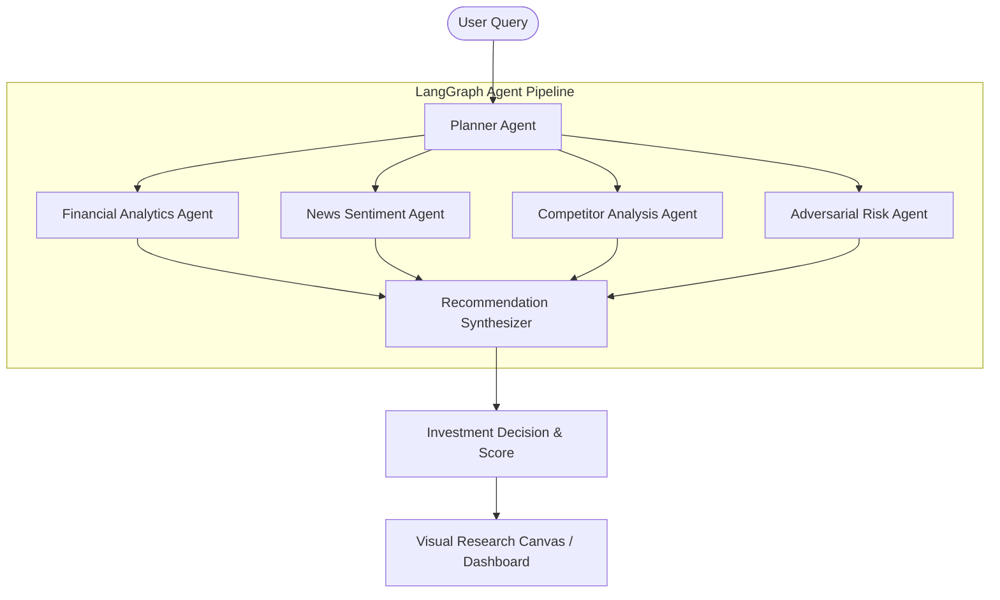

# Veriscope OS — System Architecture

This document describes the design architecture, agent execution graph, and communication channels of **Veriscope OS**.

---

## 1. System Overview

Veriscope OS is an explainable AI Company Intelligence Workspace. Instead of using generic linear chatbot Prompts, it implements an event-driven **Multi-Agent State Graph** model. 

---

## 2. Multi-Agent Coordination Layer

The backend uses a state graph coordinator powered by **LangGraph** concepts:

1. **State Schema**: A centralized workspace state holds the current target ticker, compiled evidence list, financial metrics, sentiment ratings, risk scores, and current pipeline execution logs.
2. **Planner Node**: Breaks down the research query, resolves company names to stock tickers, and schedules evidence-gathering tasks.
3. **Financial Node**: Interacts with Yahoo Finance APIs to collect balance sheets, income statements, operating margins, and growth statistics.
4. **News Node**: Searches media sources and aggregates article descriptions to compile positive, neutral, and negative sentiment distribution ratios.
5. **Competitor Node**: Performs relative valuation, comparing enterprise market caps, margins, and valuation multiples to peers.
6. **Risk Node**: Assesses geopolitical factors, supply chain dependencies, and regulatory exposure.
7. **Synthesizer Node**: Evaluates the collected evidence cards, checks sources, and outputs a final investment conviction rating with confidence metrics.

---

## 3. Tech Stack Integration

* **Frontend**: React (Vite, TypeScript, React Flow for canvas mappings, Recharts for financial visual data, Tailwind CSS for styling).
* **Backend**: Node.js (Express, TypeScript).
* **AI Pipelines**: Seeded Sandbox Mock generator (local offline demo mode) and Google Gemini / OpenAI API integration (live mode).
